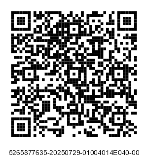
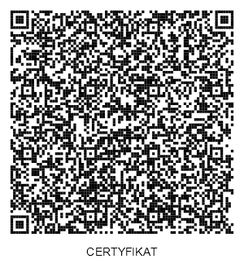

## Kody weryfikujące QR
08.07.2025

Kod QR (Quick Response) to graficzna reprezentacja tekstu, najczęściej adresu URL. W kontekście KSeF jest to zakodowany link zawierający dane identyfikujące fakturę — taki format pozwala na szybkie odczytanie informacji przy pomocy urządzeń końcowych (smartfonów lub skanerów optycznych). Dzięki temu link może być zeskanowany i przekierowany bezpośrednio do odpowiedniego zasobu systemu KSeF odpowiedzialnego za wizualizację i weryfikację faktury lub certyfikatu KSeF wystawcy.

Kody QR wprowadzono z myślą o sytuacjach, gdy faktura trafia do odbiorcy innym kanałem niż bezpośrednie pobranie z API KSeF (np. jako PDF, wydruk czy załącznik e-mail). W takich przypadkach każdy może:
- sprawdzić, czy dana faktura rzeczywiście znajduje się w systemie KSeF i czy nie została zmodyfikowana,
- pobrać jej wersję ustrukturyzowaną (plik XML) bez potrzeby kontaktu z wystawcą,
- potwierdzić autentyczność wystawcy (w przypadku faktur offline).

Generowanie kodów (zarówno dla faktur online, jak i offline) odbywa się lokalnie w aplikacji klienta na podstawie danych zawartych w wystawionej fakturze. Kod QR musi być zgodny z normą ISO/IEC 18004:2015. Jeśli nie ma możliwości umieszczenia kodu bezpośrednio na fakturze (np. format danych tego nie pozwala), należy dostarczyć go odbiorcy jako oddzielny plik graficzny lub link.

W zależności od trybu wystawienia (online czy offline) na wizualizacji faktury umieszczany jest:
- w trybie **online** — jeden kod QR (KOD I), umożliwiający weryfikację i pobranie faktury z KSeF,
- w trybie **offline** — dwa kody QR:
  - **KOD I** do weryfikacji faktury po jej przesłaniu do KSeF,
  - **KOD II** do potwierdzenia autentyczności wystawcy na podstawie [certyfikatu KSeF](\certyfikaty-KSeF.md).

### 1. KOD I – Weryfikacja i pobieranie faktury

```KOD I``` zawiera link umożliwiający odczyt i weryfikację faktury w systemie KSeF.
Po zeskanowaniu kodu QR lub kliknięciu w link użytkownik otrzyma uproszczoną prezentację podstawowych danych faktury oraz informację o jej obecności w systemie KSeF. Pełny dostęp do treści (np. pobranie pliku XML) wymaga wprowadzenie dodatkowych danych.

#### Generowanie linku
Link składa się z:
- adresu URL: `https://ksef.mf.gov.pl/client-app/invoice`,
- daty wystawienia faktury (pole `P_1`),
- NIP-u sprzedawcy,
- skrótu faktury obliczonego algorytmem SHA-256 (wyróżnik faktury).

Przykładowo dla faktury:
- data wystawienia: `01.02.2026`,
- NIP: `1111111111`,
- skrót SHA-256: `12AF615AB46644A97B8261205AB5D4A62DD9E6321DCA27967DBE1066313CA027`

Wygenerowany link wygląda następująco:
```
https://ksef.mf.gov.pl/client-app/invoice/1111111111/01-02-2026/KjUrcBrlJxBxPdRCV0gOuUmdm5dDEBbqkjN/C6dv2c8=
```

Przykład w języku ```C#```:
```csharp
var url = linkSvc.BuildInvoiceVerificationUrl(nip, issueDate, invoiceHash);
```

Przyklad w języku Java:
```java
String url = linkSvc.buildInvoiceVerificationUrl(nip, issueDate, xml);
```

#### Generowanie kodu QR
Przykład w języku ```C#```:
```csharp
var qrCode = qrSvc.GenerateQrCode(url);
```

Przyklad w języku Java:
```java
byte[] qrCode = qrSvc.generateQrCode(url);
```

#### Oznaczenie pod kodem QR
Proces przyjęcia faktury przez KSeF zazwyczaj przebiega natychmiastowo — numer KSeF generowany jest niezłwocznie po przesłaniu dokumentu. W wyjątkowych przypadkach (np. wysokie obciążenie systemu) numer może być nadany z niewielkim opóźnieniem.

- **Jeżeli numer KSeF jest znany:** pod kodem QR umieszczany jest numer KSeF faktury (dotyczy faktur online oraz faktur offline już przesłanych do systemu).



- **Jeżeli numer KSeF nie jest jeszcze nadany:** pod kodem QR umieszczany jest napis **OFFLINE** (dotyczy faktur offline przed przesłaniem lub online oczekujących na numer).


Przykład w języku ```C#```:
```csharp
var labeledQr = qrSvc.AddLabelToQrCode(qrCode, ksefNumber);
```

Przyklad w języku Java:
```java
byte[] labeledQr = qrSvc.addLabelToQrCode(qrCode, ksefNumber);
```

### 2. KOD II – Weryfikacja certyfikatu

```KOD II``` jest generowany wyłącznie dla faktur wystawianych w trybie offline (offline24, offline, tryb awaryjny) i pełni funkcję potwierdzenia autentyczności wystawcy oraz integralności faktury. Generowanie wymaga posiadania aktywnego [certyfikatu KSeF](\certyfikaty-KSeF.md); częścią linku jest podpis skrótu faktury kluczem prywatnym tego certyfikatu, co zabezpiecza przed sfałszowaniem linku przez podmioty nieposiadające dostępu do certyfikatu. Certyfikat KSeF jest wystawiany poprzez endpoint [`/certificates`](https://ksef-test.mf.gov.pl/docs/v2/index.html#tag/Certyfikaty/paths/~1api~1v2~1certificates~1enrollments/post).

#### Generowanie linku

Link składa się z:
- adresu URL: `https://ksef.mf.gov.pl/client-app/certificate`,
- NIP-u sprzedawcy,
- numeru seryjnego certyfikatu KSeF,
- skrótu faktury (SHA-256),
- podpisu tego skrótu przy użyciu klucza prywatnego certyfikatu KSeF.

Przykładowo dla faktury:
- NIP: `1111111111`,
- numer seryjny certyfikatu KSeF: `01635E98D9669239`,
- skrót SHA-256: `UtQp9Gpc51y+u3xApZjIjgkpZ01js+J8KflSPW8WzIE=`,
- podpisu tego skrótu przy użyciu klucza prywatnego certyfikatu KSeF: `UtQp9Gpc51y+u3xApZjIjgkpZ01js+J8KflSPW8WzIE=/ijD7zYpvqY4%2b1HbIJ7YR8Cc0M0M5G80FH64fKHHyRBA%2bOcT5xnK8hJT6%2b1F1lLtcLMNEHM2MssAaxi1JimISg49K%2f476r%2b%2buYDUqrGRr2kTXOPxOIE47Wk8M0qoPd3U9UuQf3H59SsWLHATqtrpr1HrNYMOJDgNun%2bfKHCYTv7gPLqwRnaG7b5X2TExusLs4T2t73YMVIrBy4j3QKNRUXhNmrLtEZQlNsUieMy8g9jRF5lxdyE7HqF5ZnulVEQSxQj9R89nF083CDtBnKcs6OLeWH72MsPL17KJd6lB%2b2jLaVNfBI5kD84CEC1jNHcpHQ%2fv8LYIYqj0hDeNl5GHq6A%3d%3d`

Wygenerowany link wygląda następująco:

```
https://ksef.mf.gov.pl/client-app/certificate/1111111111/01635E98D9669239/UtQp9Gpc51y+u3xApZjIjgkpZ01js+J8KflSPW8WzIE=/ijD7zYpvqY4%2b1HbIJ7YR8Cc0M0M5G80FH64fKHHyRBA%2bOcT5xnK8hJT6%2b1F1lLtcLMNEHM2MssAaxi1JimISg49K%2f476r%2b%2buYDUqrGRr2kTXOPxOIE47Wk8M0qoPd3U9UuQf3H59SsWLHATqtrpr1HrNYMOJDgNun%2bfKHCYTv7gPLqwRnaG7b5X2TExusLs4T2t73YMVIrBy4j3QKNRUXhNmrLtEZQlNsUieMy8g9jRF5lxdyE7HqF5ZnulVEQSxQj9R89nF083CDtBnKcs6OLeWH72MsPL17KJd6lB%2b2jLaVNfBI5kD84CEC1jNHcpHQ%2fv8LYIYqj0hDeNl5GHq6A%3d%3d
```

Przykład w języku ```C#```:
```csharp
 var cert = new X509Certificate2(Convert.FromBase64String(certbase64));
 var url = linkSvc.BuildCertificateVerificationUrl(nip, certSerial, invoiceHash, cert, privateKey);
```

Przykład w języku Java:
```java
String pem = privateKeyPemBase64.replaceAll("\\s+", "");
byte[] keyBytes = java.util.Base64.getDecoder().decode(pem);
PrivateKey privateKey = new DefaultCryptographyService(ksefClient).parsePrivateKeyFromPem(keyBytes);

String url = linkSvc.buildCertificateVerificationUrl(nip, certSerial, xml, privateKey);
```

#### Generowanie QR kodu
Przykład w języku ```C#```:
```csharp
var qrCode = qrSvc.GenerateQrCode(url);
```

Przykład w języku Java:
```java
byte[] qrCode = qrSvc.generateQrCode(url);
```

#### Oznaczenie pod kodem QR

Pod kodem QR powinien znaleźć się podpis **CERTYFIKAT**, wskazujący na funkcję weryfikacji certyfikatu KSeF.

Przykład w języku ```C#```:
```csharp
var labeledQr = qrSvc.AddLabelToQrCode(qrCode, "CERTYFIKAT");
```

Przykład w języku Java:
```java
byte[] labeledQr = qrSvc.addLabelToQrCode(qrCode, "CERTYFIKAT");
```



Przykład w języku ```C#```:
```csharp
var labeledQr = qrSvc.AddLabelToQrCode(qrCode, "CERTYFIKAT");
```

